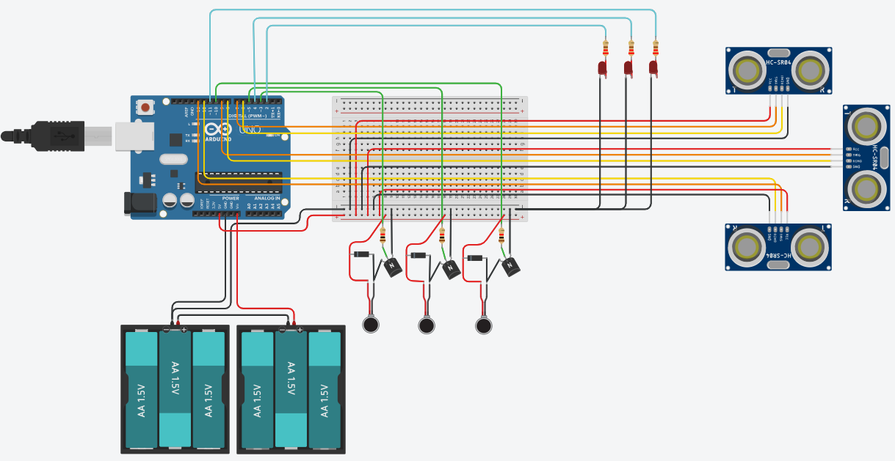

# Smart Cane for Blind People | Bengala Inteligente para Pessoas Cegas

Project created in [Tinkercad Circuits]([https://www.tinkercad.com/things/2zf2aNh3tPM-smart-cane-for-blind-people?sharecode=UcpeKC4ccouz-GRL802ICmL490bSLYakYSFHOJxbHKk]).

## Circuito


## Código
```cpp
const int trigPins[3] = {7, 9, 13};
const int echoPins[3] = {6, 8, 12};
const int motorPins[3] = {3, 5, 10};
const int ledPins[3] = {2, 4, 11};

long duration;
float distanceCm;

void setup() {
  Serial.begin(9600);

  for (int i = 0; i < 3; i++) {
    pinMode(trigPins[i], OUTPUT);
    pinMode(echoPins[i], INPUT);
    pinMode(motorPins[i], OUTPUT);
    pinMode(ledPins[i], OUTPUT);
  }
}

float measureDistance(int trigPin, int echoPin) {
  digitalWrite(trigPin, LOW);
  delayMicroseconds(2);
  digitalWrite(trigPin, HIGH);
  delayMicroseconds(10);
  digitalWrite(trigPin, LOW);

  duration = pulseIn(echoPin, HIGH, 30000);
  if (duration == 0) return -1;
  return (duration * 0.0343) / 2.0;
}

void loop() {
  for (int i = 0; i < 3; i++) {
    float d = measureDistance(trigPins[i], echoPins[i]);

    int intensity = 0;
    if (d > 0 && d <= 220) {
      intensity = map(d, 0, 220, 220, 0);
    }

    analogWrite(motorPins[i], intensity);

    if (intensity > 0) {
      digitalWrite(ledPins[i], HIGH);
    } else {
      digitalWrite(ledPins[i], LOW);
    }

    Serial.print("Sensor ");
    Serial.print(i + 1);
    Serial.print(": ");
    Serial.print(d);
    Serial.print(" cm | Motor PWM: ");
    Serial.print(intensity);
    Serial.print(" | LED: ");
    Serial.println(intensity > 0 ? "ON" : "OFF");

    delay(50);
  }

  delay(100);
}
